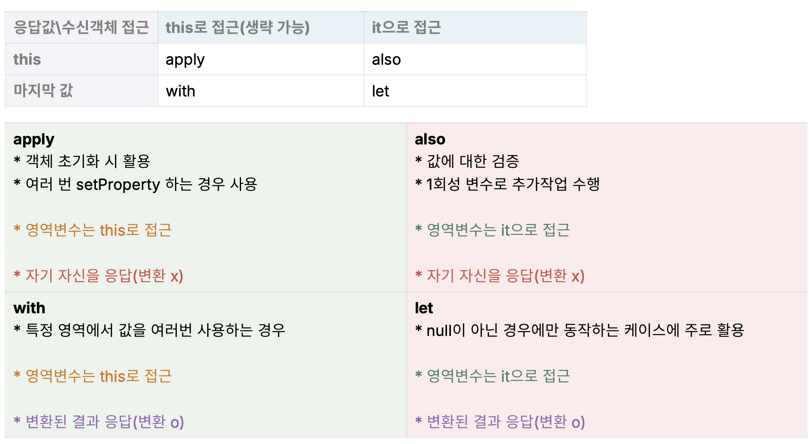

# Kotlin 좀더 활용(적용)
- Spring boot 로 컨버팅을 한다고 해서, 코틀린의 장점들을 사용하는것은 아니다.
- 코틀린을 이해하고, 장점들을 활용/적용 하는것이 중요할듯 하다
- 그리고 코틀린의 특성을 알고 활용해야 하는 방법들

---
## 1. .kt 파일 적극 활용
- 코틀린 파일(*.kt) 하나에 여러 클래스나 변수, 메서드 등을 정의할 수 있는 장점이 존재한다.

#### 1-1 Enum 들을 하나의 파일에 정의 
- 자바의 경우 enum 이 여러 파일로 나뉘어 존재됨 -> enum 을 찾기도 어렵고, 중복 발생함(관리 어려움)
- 코틀린의 경우 유사한 enum 들을 하나의 파일에 정의할 수 있다.
  - 유사한 enum 들을 하나의 파일에 정의함으로써, enum 들을 찾기 쉽고, 중복 발생을 방지할 수 있다.
  - 다만, 너무 많은 enum 들을 하나의 파일에 정의하면 가독성이 떨어질 수 있으므로, 적절한 수준에서 관리하는 것이 좋다.

<br>

#### 1-2 method, constant 를 최상위에 넣기
- 자바의 경우 Util Class 생성 후 생성자를 private 선언 (lombok @UtilityClass 활용)
- 코틀린은 최상위에 method, constant 를 정의할 수 있다.
  - 자주 사용하는 Util 의 경우 클래스를 생성하지 않고 파일의 최상위에 정의하여 사용하게함(많이 사용)
  - 또는 확장함수로 만들면 편의성이 더욱 증대됨
    - "string".encrypt()
    - requestDto.toJson()
  - 변수나 상수의 경우도 최상위에 존재 가능함

<br>

#### 1-3 request/response DTO 를 Controller 에 통합(병합)
- 기존 자바의 경우 dto package 에 별도로 정의 이때 도메인에 따라 비슷한 DTO 가 여러개 존재함
  - 코드의 중복 발생, 관리 어려움
  - request/response 를 하나의 Class 에 `nested Class(중첩 클래스)` 형태로 사용하기도 함
- Kotlin 에서는 하나의 파일내에 Controller 와 request/response 객체를 함께 둘 수 있다.
  - 파일수도 줄고, 비슷한 관심사가 모여있는 Controller 클래스 내에서 관리 하기 편함(결합도가 높은것 끼리 모여있음)
- 근데 ? API당 1개씩 정의하는게 좋다는데 (파일 하나씩) 이 또한 파일이 많아지게 됨으로 실효성 모르겠다.


<br>

---

## 2. Kotlin 의 특성 

#### 1. Null Safety(Not null)
- 코틀린의 가장 큰 장점(특징) 중 하나는 Null Handling 이다.
- Nullable 하게 활용할수 있지만, Null Safety 하게 활용하여, RunTime 시 NPE 를 방지할 수 있다.
  - `Nullable 이라면?` 각 레이어 마다 코틀린에서는 Null 일때 어떻게 할래?, 어떻게 처리할래? 를 물어본다.
    - '?', '?:', '!!' 와 같은 연산자를 사용하여 대응하거나 다른방법 사용
  - 그래서 `Not Null` 로 바꾸는게 좋을수도 있다(또 하나의 관점)
> #### 가장 좋은 Best Practice
> - 가능한 경우 `Not null` 로 최대한 정의할것.
>> - `외부에서 받는 요청`,`외부에 요청하는 API`
>>   - 스펙 확인하여 데이터에 따라 null, not null 구분
>> - `DB`
>>   - 컬럼의 Nullable 을 확인하여 구분
>>   - 다만 컬럼이 Nullable 이어도 실제로는 Not Null 로 사용하는 경우도 많음. -> 컬럼도 최대한 Not null 로 정의할것. 

#### 2. Optional, Stream 제거하기 
- 코틀린에서는 Optional, Stream 을 사용할 이유가 없다.
- `Optional`
  - Nullable 한 데이터를 안전하게 처리하는 방법이다.
  - 꼭필요한 데이터가 없으면 Exception, 데이터가 없는경우 대체값(기본값) 지정
  - 이건 `Kotlin` 에서는 '?' 연산자로 대체할 수 있다. -> 즉 Optional Wrapping 할 이유가 없다.
    - `optionalData ?: throw Exception("데이터가 없습니다."), optionalData ?: "default data"` 
- `stream`
  - 배열, 컬렉션 데이터 각각을 처리하는 다양한 공통된 기능 제공
    - 데이터 필터링, 데이터 매핑(변환), 데이터 정렬, 데이터 집계 등 복합적으로 활용하는 기능임
  - kotlin 에서는 스트림을 열지 않고 바로 기능들을 사용할 수 있음(filter, map, sorted 등)

#### 3. 범위 함수(scope function)
- 코틀린에서는 범위 함수를 사용하여 객체를 더 간결하게 다룰 수 있다.
- 변수의 사용범위 지정, 불필요한 변수 선언하지 않고 활용할 수 있는 기법
- 즉 특정영역에서만 사용되는 변수나 객체를 정의할 수 있다. 범위를 벗어나면 제거됨
- 범위 함수는 크게 5가지가 있다.



---


---

## x. etc 활용법들 

#### 1. 확장함수 활용 - static 메서드 대체
- Java 에서 toEntity, toDTO 와 같은 변환 메서드를 많이 사용한다.
  - Entity -> DTO 로 변환시에는 DTO 내부에 fromEntity() 메서드를 정의하여 사용하는 경우가 많음
    - Entity 객체를 DTO 객체로 변환 하여 반환 하는등
    - 이걸 Kotlin 으로 변환한다면 companion object 내부에 Static 메서드로 정의하고는 한다.
  - 이걸 확장함수로 정의하는 방법또한 존재한다. (CreatePrince.kt 의 Prince.toCreatePrinceResponse() 참고)
```kotlin
// 기존
class UserDto {
    companion object {
        fun fromEntity(entity: UserEntity): UserDto {
            return UserDto(
                id = entity.id,
                name = entity.name
            )
        }
    }
}

// 확장함수로 정의
fun UserEntity.toDto(): UserDto {
    return UserDto(
        id = this.id,
        name = this.name
    )
}
```
 


<br>

#### 2. Dummy 객체 활용 - 최상위 함수
- 테스트용 더미 객체를 생성할때, 매번 생성하고 수정 발생시 수정하는것은 꽤나 번거로운 작업이다.
- 이럴때 최상위 함수로 정의하여 사용하는 방법이 있다.
 


