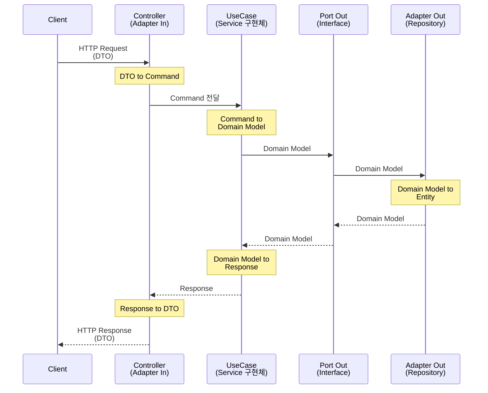

# Hexagonal Architecture Example in Kotlin

- 이 모듈은 `헥사고날 아키텍처 패턴`을 `Kotlin` 으로 구현한 예제.
- 순수한 헥사고날 아키텍처 원칙을 따르며, 각 구성요소를 명확하게 분리. 

---

## Spec 
- kotlin 1.9.25
- java 17 
- Spring boot 3.4.10
- Spring Data JPA
- PostgreSQL 17-alpine
- H2 Database (Local Memory Only)
- KoTest

---

## Project Structure

- `domain`: 도메인 모델과 비즈니스 규칙을 포함.
  - `model`: 핵심 비즈니스 객체 (예: User, Order).
  - `dto`: 불변 값 객체 (예: UserDTO).
  
- `application`: 애플리케이션 서비스, 유스케이스, Commands 포함.
  - `port`: 포트(인터페이스) 정의.
    - `in`: 애플리케이션으로 들어오는 요청을 처리하는 포트 (예: UserUseCase).
    - `out`: 외부 시스템과 상호작용하는 포트 (예: UserRepository).
  - `commands` : Data 를 adapter 에서 port 로 넘겨줄때 사용하는 Command 객체 (예: UserCommand).
  - `service`: 유스케이스 구현체 (예: UserService). -> `UserUseCase 의 구현체`
  
- `adapter`: 외부 시스템과의 상호작용을 담당.
  - `in`: 애플리케이션으로 들어오는 요청을 처리하는 어댑터 (예: UserController).
  - `out`: 외부 시스템과 상호작용하는 어댑터 (예: UserRepositoryAdapter). -> `application.port.out` 인터페이스 구현.
    - `persistence`: 데이터베이스와 상호작용하는 어댑터 (예: UserJpaEntity, SpringDataUserRepository).

